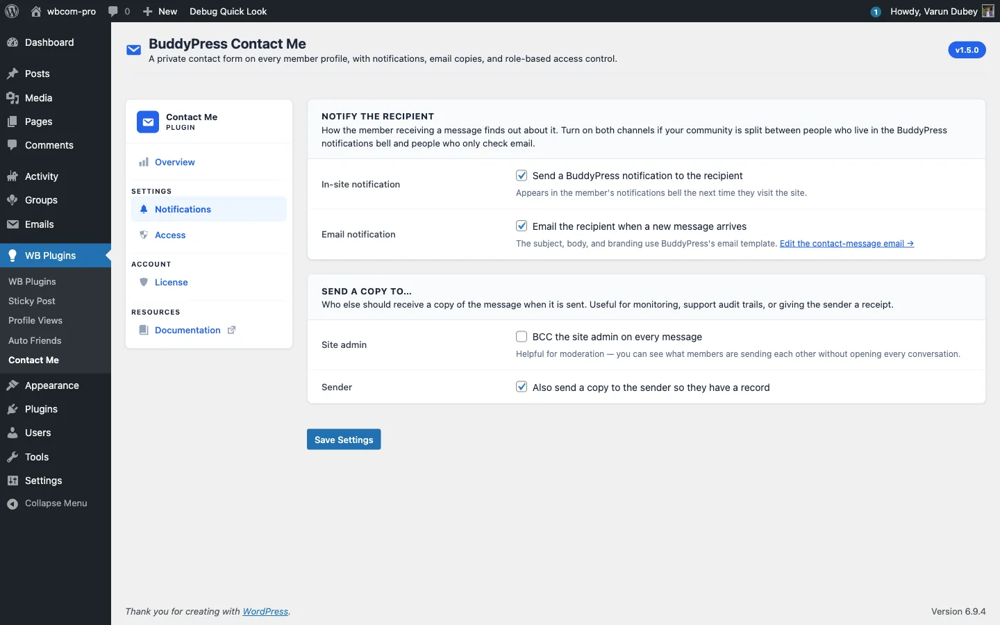

# BuddyPress Notifications and Email Delivery

Every contact-message submission can fire a BuddyPress in-site notification, an email, or both. Both run on the recipient's behalf: they are notified, while the sender just sees a "Message sent" confirmation.

## In-site notifications

Powered by the BuddyPress Notifications component. When enabled:

- A new entry appears in the recipient's notification bell.
- The entry text reads "{Sender display name} sent you a contact message." and links to `/contact/inbox/{message-id}/`.
- Opening the message clears the notification automatically. See [Single message view](03-single-message-view.md).

If the BuddyPress Notifications component is disabled site-wide, this channel quietly does nothing; nothing breaks.

The plugin registers a notifications component named `bcm_user_notifications` with the action `bcm_user_notifications_action`, so entries sit alongside core BP notifications.

## Email notifications

Powered by `bp_send_email()` and a dedicated email post of type `bcm-contact-message` installed automatically on activation. Because it goes through the BuddyPress email pipeline:

- The email uses the same header, body card, footer, and unsubscribe link as every other BuddyPress email on the site, so there is no theme work.
- Site admins can edit the subject and body from **Dashboard > Emails**. Find the entry by its situation description, "A member (or visitor) sent a contact message from your profile." Once an admin edits it, future plugin upgrades never overwrite those changes.
- The plugin-provided tokens are `{{sender.name}}`, `{{recipient.name}}`, `{{contact.subject}}`, `{{{contact.message}}}`, and `{{{inbox.url}}}` (triple braces where the value embeds HTML or a URL). BP-native tokens such as `{{{site.name}}}` and the unsubscribe link are also available.

See the [Email pipeline](../developer-guide/02-email-pipeline.md) developer doc for the exact token list and post structure.

## Send-a-copy options

Two extra recipient toggles on the Notifications tab:

- **Site admin copy** - send every message to every user with the `administrator` role. Useful for community moderation. Off by default.
- **Sender copy** - send the sender a copy of what they submitted. Useful as a "we got your message" receipt. On by default.

## Per-recipient delivery

`bp_send_email()` is called once with the full recipient list, and BuddyPress sends one email per recipient internally, so recipients never see each other's email addresses. Guest recipients (a sender copy where the sender was a guest) are built with the saved guest name so the BP email pipeline does not emit undefined-property warnings on PHP 8.2 and above.

## Output buffering safety

Because `bp_send_email()` runs inside the submit request, the plugin output-buffers the call so a stray notice or whitespace from a third-party hook cannot break the JSON response. Leaked output is captured and logged via `error_log()` when `WP_DEBUG` is on, never printed to the response stream.
