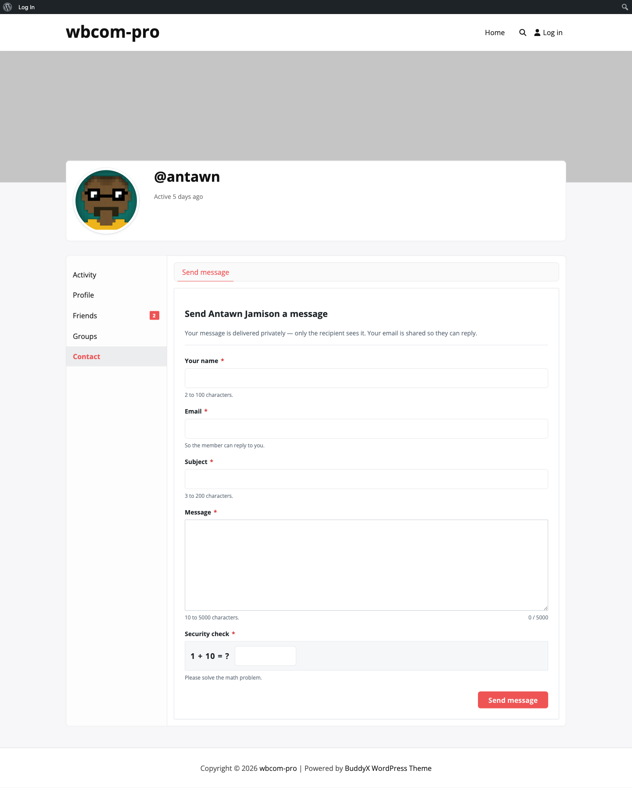

# Guest Contact with Math Captcha & Spam Heuristic

Logged-out visitors can reach members through the same contact form, with two extra fields and a built-in spam defence.

## Enabling guest contact

1. Go to **WB Plugins → Contact Me → Access**.
2. In the **Who can send messages** group, tick **Visitors (not logged in)**.
3. Save.

If the checkbox is unchecked, the form returns a "You are not allowed to send messages." error for any unauthenticated submission.

## What the visitor sees

Three extra elements appear when no user is logged in:

- **Your name** — required, 2 to 100 characters.
- **Email** — required, must pass `is_email()`; the recipient uses this to reply.
- **Security check** — a math captcha rendered as `X + Y = ?` for the visitor to solve.

The subject and message fields are the same as the logged-in version (3–200 and 10–5000 characters).

## Math captcha — how it works

When the form renders, the server emits a random sum like `7 + 4` and a hashed value derived from the answer (`wp_hash($answer)`) into a hidden field. On submit, the answer the visitor typed is hashed the same way and compared with `hash_equals` — the same constant-time check WordPress uses for nonces.

This means:

- The captcha cannot be guessed without solving the sum.
- It works without any third-party service or API key.
- Members never see it — `validate_captcha()` short-circuits for `is_user_logged_in()`.

## Spam heuristic

After the captcha passes, the message body runs through a built-in regex screen (`looks_like_spam` in `class-bcm-frontend-submit.php`) that flags submissions matching obvious patterns:

- Pharma terms (viagra, cialis, levitra, pharmacy, pills, medication).
- Gambling terms (casino, poker, blackjack, slots, gambling).
- Loan / debt offers ("loan offer", "credit approval", "mortgage rate").
- Aggressive call-to-action phrasing ("click here", "buy now", "limited time").
- Lottery / prize spam ("you won", "congratulations winner", "million dollar").
- Three or more URLs in the same message body.

A flagged submission is rejected with the message "Your message was flagged as spam. Please rephrase and try again." The result is filterable via `bcm_spam_check` (see [Hooks & filters](../developer-guide/hooks-and-filters.md)) so you can soften, harden, or replace the heuristic without forking the plugin.

## What the recipient gets

Guest submissions land in the same inbox as member submissions, with a "Guest" badge in the single-message view to make the source obvious. The recipient can reply by email (the `mailto:` link uses the address the visitor entered) but cannot start a BuddyPress private message — the sender does not have a BuddyPress account.
