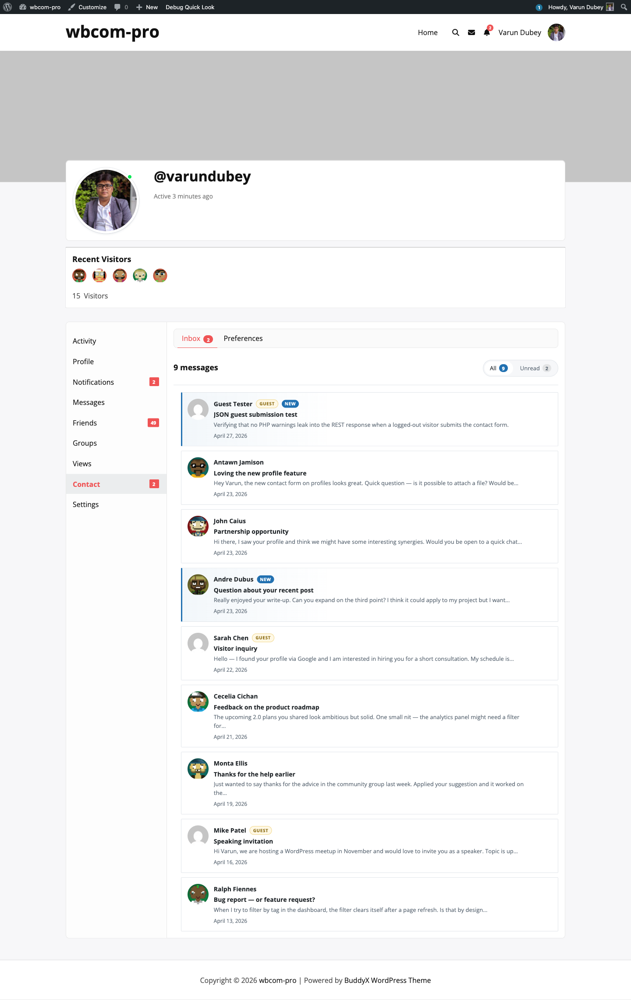

# Inbox on the Member's Own Profile

Each member sees a dedicated inbox of every contact message they have received, on their own BuddyPress profile.

## How members reach it

- Click **Contact** on their own profile and then **Inbox** in the sub-nav.
- Click a notification bell entry — the link goes straight to the single-message view.
- Click **Contact** in the WordPress admin bar (under "My Account") — same destination.

The inbox URL is `/{user-slug}/contact/inbox/`. The default sub-nav slug for the Contact tab on the member's own profile is `inbox`, so a bare `/contact/` URL also lands here.

## Layout

Each row in the listing shows:

- The sender's avatar (or a generic guest avatar for non-member submissions).
- The sender's display name, with a **Guest** badge for non-member submissions and a **New** badge for unread messages.
- The subject, bold.
- The first line of the message, trimmed.
- The submission date.

## Unread filter

The inbox has two filters at the top:

- **All** — every message the member has ever received.
- **Unread** — only messages with an active BuddyPress notification (i.e. the recipient has not yet opened them).

The Unread filter relies on the BuddyPress Notifications component. If notifications are disabled site-wide the filter still renders but always returns an empty list — the inbox itself is unaffected.

## Unread badge in the nav

The "Contact" parent nav item shows a count badge when the inbox has unread messages. The number tracks the same data the **Unread** filter uses: BuddyPress notifications belonging to the `bcm_user_notifications` component that are still flagged `is_new = 1`.

## Pagination

Messages render 10 per page in newest-first order. Older pages link via standard BuddyPress pagination at the bottom of the listing.

## Privacy

Only the recipient can read their inbox. The single-message view enforces this via `delete_for_recipient()` in `BCM_Messages_Repo` and the `require_message_owner` permission callback on the REST delete endpoint — even direct URL access to a stranger's message ID returns "Message not found".
