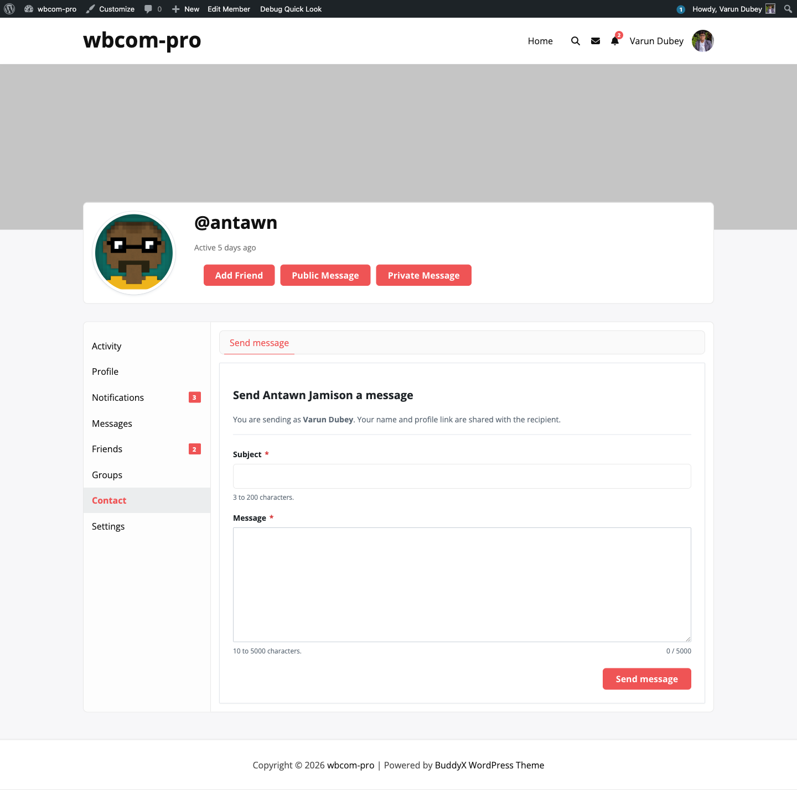

# Per-Member Opt-Out from BP Settings

Even when an admin's role allow-list says a member can be contacted, every member keeps a personal opt-out switch. Privacy stays in the user's hands.



## Where members find the toggle

1. Member opens their own profile.
2. Clicks **Settings** in the profile sub-nav, then **General** (this is BuddyPress's standard settings screen).
3. Scrolls to the line: **Let other members contact me through a form on my profile.**
4. Unticks the box and clicks **Save Changes**.

The toggle is added to the BP Settings → General screen via the `bp_core_general_settings_before_submit` hook, so it sits alongside the user's account-level preferences where members already look for privacy controls.

## What "opt-out" actually does

When a member opts out, two things happen:

- The "Contact" tab disappears from their public profile.
- Submissions targeted at them via `[buddypress-contact-me id=...]` shortcode return an empty render.

The user's `contact_me_button` user-meta is set to `'off'`. Every check (`BCM_Frontend_Nav::user_accepts_contact()`) short-circuits to `false` when this meta is `'off'`.

## Default behaviour

New users default to opted-in (the activator and the `user_register` hook both set the meta to `'on'`), so the plugin is valuable out of the box without per-user configuration.

The 1.5.0 release migrated any pre-existing empty-string values to `'on'` so the meta is self-consistent: `'off'` means opted-out, anything else means opted-in.

## Admin override

Admins (users with the `administrator` role) can always be contacted regardless of the role allow-list — but the per-user opt-out still applies. If an admin sets their own meta to `'off'`, their Contact tab disappears too.

## Reactivating

A member can re-tick the box at any time. The change takes effect immediately on the next request — no caching or scheduled job involved.

## Programmatic check

If you need to check the opt-out state from code:

```php
$accepts_contact = BCM_Frontend_Nav::user_accepts_contact( $user_id );
```

The static method returns `true` when the user is opted-in **and** in an allowed role group, `false` otherwise. It is the same gate used by the nav and the form submission handlers, so it stays in lockstep with what the rest of the plugin sees.
