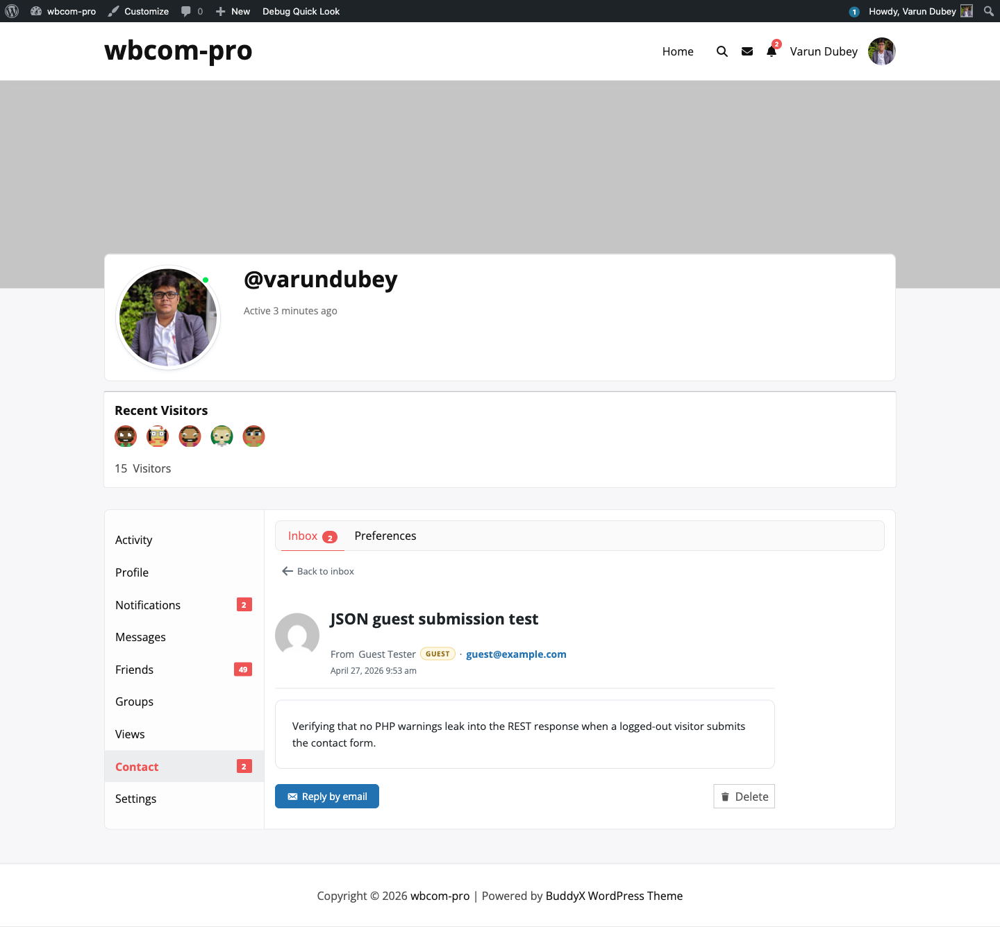

# Single Message View — Reply, Visit, Delete

Clicking a message in the inbox opens a full-page view of that one message with all the actions a recipient typically wants.

## URL pattern

The single-message view lives at `/{user-slug}/contact/inbox/{message-id}/`. Notification bell links and email "Open in your inbox" links target this URL directly.

If the message ID does not exist or belongs to someone else, the page renders a "Message not found" empty state with a **Back to inbox** button — never a stranger's content.

## Header

The header shows:

- The sender's avatar (BuddyPress avatar for members, Gravatar fallback for guests).
- The subject, large.
- The sender's name, linked to their profile if they are a member, otherwise marked with a **Guest** badge.
- The sender's email — clickable as a `mailto:` for quick reply.
- The submission timestamp in the site's date and time format.

## Action buttons

A row of action buttons appears below the message body. Which buttons render depends on whether the sender is a member and whether they left contact details:

- **Send private message** — primary action when the sender is a BuddyPress member and the Messages component is active. Opens the standard BP private-message compose form addressed to them.
- **Reply by email** — opens a `mailto:` with the subject pre-filled as `Re: {original subject}`. Works for both member and guest senders as long as an email is available.
- **Visit profile** — opens the sender's profile in a new tab. Only renders for member senders.
- **Delete** — soft-confirm button that calls the REST delete endpoint with a fresh nonce, then routes back to the inbox.

If the sender left no contact details at all (rare edge case — guest with empty email), the page surfaces a warning that there is no way to reply but still allows delete.

## Marking as read

Opening the single-message view automatically clears the BuddyPress notification tied to that message — the unread badge in the parent **Contact** nav and the **Unread** filter both update on next page load. The mark-as-read step is scoped: only the notification for that specific message is touched, so other unread messages stay flagged.

## Delete action

Clicking **Delete** calls `DELETE /wp-json/bcm/v1/messages/{id}` with the `wp_rest` nonce and the form nonce for defence in depth. The endpoint enforces ownership at the permission layer — it returns 403 if the current user is not the recipient — so deletion is impossible from another account even with a guessed ID.

After a successful delete the page redirects back to the inbox with a flash success message.
