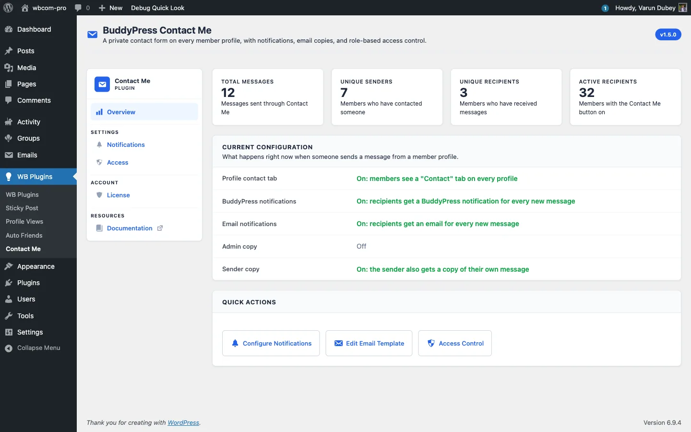

# What BuddyPress Contact Me Does

BuddyPress Contact Me adds a private "Contact" tab to every member profile. Visitors and other members can send a message without ever seeing the recipient's email address. The recipient gets a BuddyPress notification, an email through the standard BuddyPress email template, or both. It is your choice.

## Who it is for

- Community sites that want members to be reachable without exposing email addresses.
- Membership and directory sites where guests need to contact listed members.
- Mentor, coach, and consultant communities where inbound contact has to flow through a structured form, not a public email link.

## What you get out of the box

- A "Contact" tab on every member profile that accepts contact.
- A built-in inbox at `/contact/inbox/` on the member's own profile, with an "Unread" filter and an unread badge in the nav.
- Email notification to the recipient using the official BuddyPress email template, so there is no custom templating to maintain.
- BuddyPress notification-bell entries for in-site notifications.
- Role-based access control: pick which roles can send messages and which roles can receive them.
- Per-member opt-out via BuddyPress Settings, so every member keeps the final say.
- A math captcha and a built-in spam heuristic for logged-out submissions.
- A `[buddypress-contact-me]` shortcode for embedding the form on any page.
- An admin-bar shortcut: "Contact" appears under My Account so members can reach their inbox in one click.

## Sensible defaults

On activation the plugin turns the profile Contact tab, BuddyPress notifications, email notifications, and the sender-copy receipt on, and leaves the admin-copy off. Guest contact is enabled by default too, because the "Visitors (not logged in)" group is pre-selected in the "Who can send messages" list. You can change any of this from the Access and Notifications tabs.

## What it does not do

- Two-way messaging. A recipient replies through email or BuddyPress private messages, not through this plugin's inbox.
- Threading or attachments. Messages are single-shot and text only.
- External user-store integrations. The plugin reads BuddyPress (or BuddyBoss Platform) user data only.

## Compatibility

- WordPress 6.0 and above (tested up to 6.9).
- PHP 7.4 and above (tested on 8.4).
- BuddyPress and BuddyBoss Platform.
- BuddyX, BuddyX Pro, Reign, and BuddyBoss themes, including their dark-mode variants.

## What's next

The next page covers installing and activating the plugin. After that the Features docs explain the user-facing behaviour, the Settings docs walk through the four admin tabs (Overview, Notifications, Access, License), and the Developer Guide documents the REST routes and hooks.
