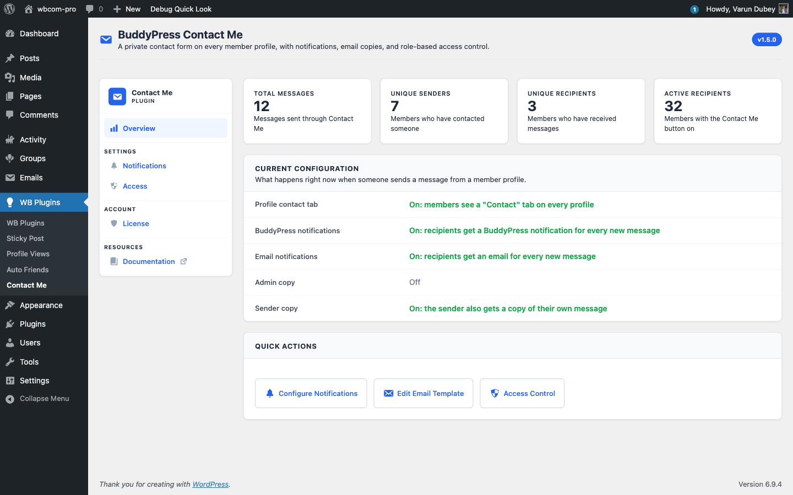

# Install & Activate the Plugin

This page walks through installing BuddyPress Contact Me and reaching its admin screen for the first time.

## Requirements

| Requirement | Minimum | Tested |
|-------------|---------|--------|
| WordPress   | 6.0     | 6.9    |
| PHP         | 7.4     | 8.4    |
| BuddyPress  | 12.0    | 14.x   |

The BuddyPress Notifications component must be active if you want in-site notification bell entries — email notifications work without it.

## Install via WordPress admin

1. Go to **Plugins → Add New**.
2. Click **Upload Plugin** and choose the ZIP you downloaded from your Wbcom Designs account.
3. Click **Install Now**, then **Activate Plugin**.

After activation, WordPress redirects you to the Contact Me admin screen automatically.

## Install via FTP

1. Unzip the plugin archive on your computer. You will get a folder named `buddypress-contact-me`.
2. Upload the folder to `/wp-content/plugins/` on your server.
3. Go to **Plugins → Installed Plugins** and click **Activate** under "Wbcom Designs - BuddyPress Contact Me".

## Install via WP-CLI

```bash
wp plugin install /path/to/buddypress-contact-me.zip --activate
```

## What happens on activation

The activator runs once and does the following:

1. Creates the `{prefix}contact_me` table that stores all submitted messages.
2. Stores the current plugin version in the `buddypress_contact_me_db_version` option.
3. Sets every existing user's `contact_me_button` user-meta to `on`, so existing members default to "accepting contact".
4. Installs a BuddyPress email post of type `bcm-contact-message` so notifications render through the BuddyPress email template. Once you edit that email from **Dashboard → Emails**, the plugin will not overwrite your changes on future upgrades.

## Find the admin screen

Wbcom plugins share a single top-level WordPress menu called **WB Plugins**. After activation:

1. Open **WB Plugins** in the sidebar.
2. Click **Contact Me** in the submenu.

You land on the Overview tab. The sidebar inside the page lists the four tabs: Overview, Notifications, Access, and License.



## Recommended first-run checklist

1. **Notifications tab** — turn on at least one of "BuddyPress notification" or "Email notification" so recipients actually find out about new messages.
2. **Access tab** — confirm the role allow-lists match your community. By default every logged-in role can send and receive.
3. **License tab** — paste your license key and click **Activate License** so the plugin can pull updates straight from your dashboard.

## What's next

The License doc explains exactly what activation does and how to rotate keys. After that the Features section walks through every user-facing surface in detail.
