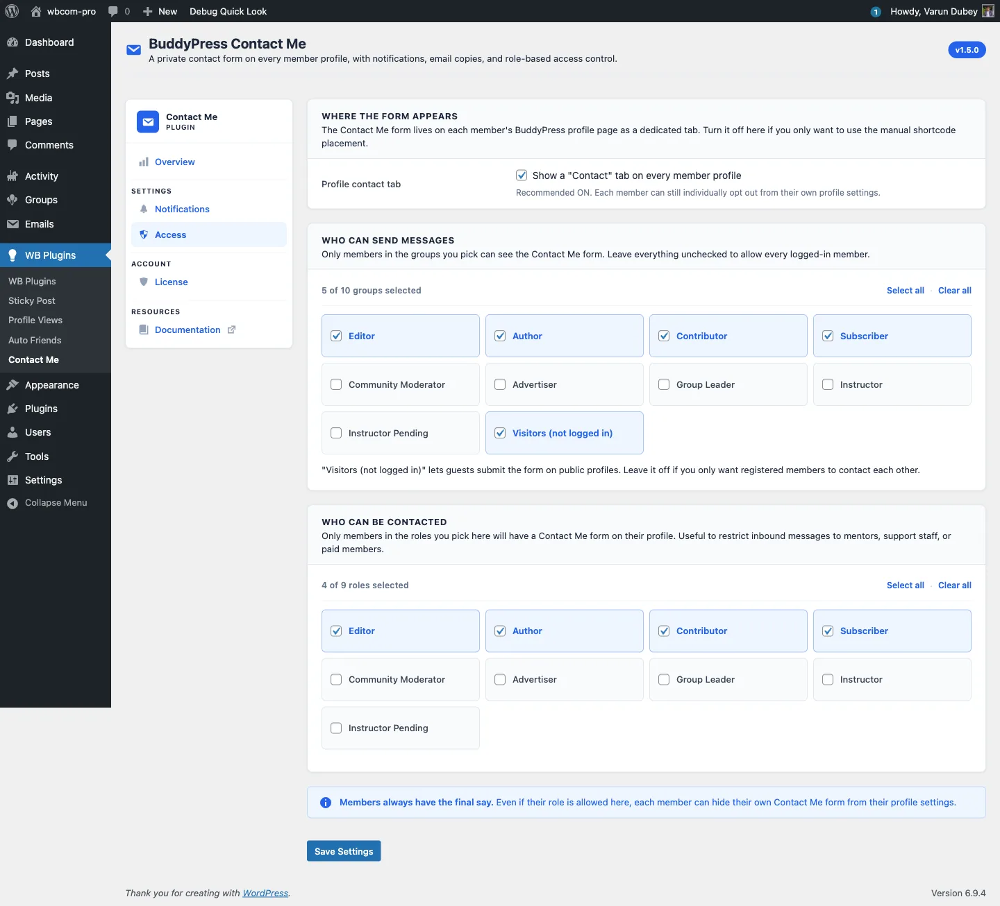

# Access Tab: Who Can Send and Be Contacted

The Access tab controls every gate around the contact form: where it appears, which roles can send a message, and which roles can receive one.

## Where the form appears

A single toggle at the top:

- **Show a "Contact" tab on every member profile** - when off, the profile-tab integration is hidden entirely. Members can still be reached through the `[buddypress-contact-me]` shortcode if you want to drive contact through specific landing pages.

Recommended on. Each member can still individually opt out from their own profile settings. See [Per-member opt-out](../features/05-opt-out.md).

## Who can send messages

A grid of role chips covering every WordPress role on the site except Administrator, plus a special **Visitors (not logged in)** chip for guest contact. Administrators are always allowed, so they are not listed here.

- Tick the chips for the roles you want to allow.
- Use **Select all** or **Clear all** to apply to the whole grid.
- An empty grid is persisted. Note that clearing the entire send grid allows everyone to send, rather than no one. To lock sending down, select only the roles you want.

The **Visitors** chip controls whether guests may submit. When the grid is non-empty and Visitors is unticked, a guest submission is rejected with "You are not allowed to send messages." This permission is enforced when the form is submitted, so a disallowed sender may still see the form but cannot complete it.

## Who can be contacted

The same chip grid (again excluding Administrator), applied to the recipient side. A member's Contact tab renders only if their role is in this list, or they are an administrator (admins are always contactable). Use this to restrict inbound messages to a specific group such as mentors, support staff, or paid members. Members in unlisted roles do not show the Contact tab even when the global toggle above is on.

## Members always have the final say

The notice at the bottom is a reminder: even when a role is allowed, the individual member can still opt out via **Profile > Settings > General > Let other members contact me**. The plugin never overrides the per-member preference. See [Per-member opt-out](../features/05-opt-out.md).

## Mobile-friendly chips

The grid uses chip controls instead of a multi-select dropdown, on purpose:

- Every option is visible at once, with no hidden state behind a click.
- Tap targets are large enough for thumb interaction on mobile.
- **Select all** and **Clear all** apply to the whole grid.

## Save behaviour

Saving the Access tab touches only the role lists and the **Show a Contact tab** toggle. Notification preferences on the [Notifications](01-notifications-tab.md) tab are preserved. The two tabs save independently, and a "Clear all" on a grid persists as an empty selection rather than reverting on the next load.

## What's next

Once access is configured, the [License](03-license-tab.md) tab links your purchase to your site so future updates flow into the WordPress Plugins screen.
