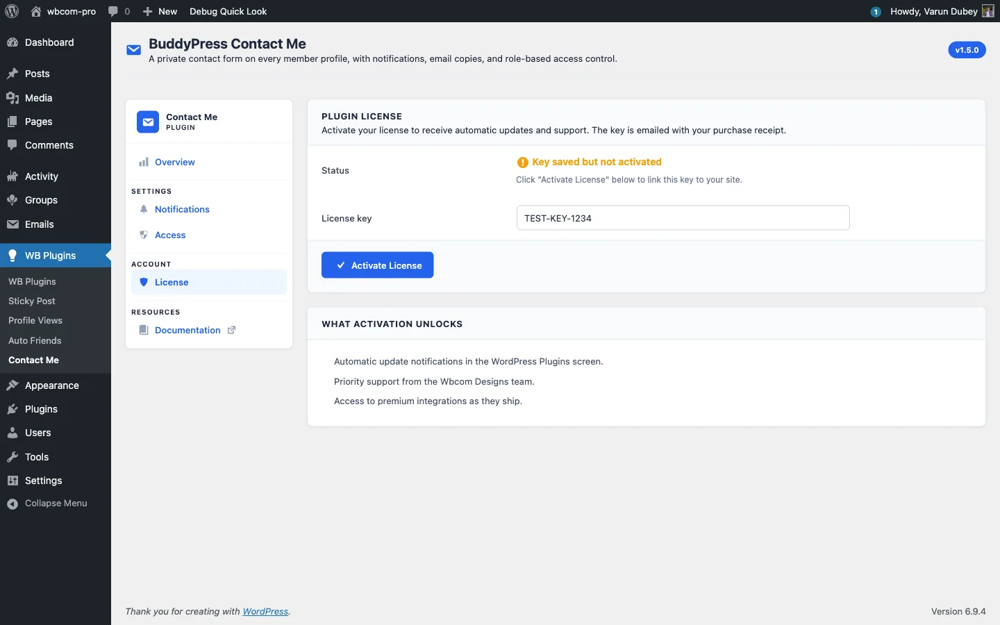

# License Tab: Activate and Rotate Keys

The License tab connects your Wbcom Designs purchase to this site so the plugin can pull updates. Activation links your license key to the site; the plugin keeps working at full capability without it, only updates and priority support are gated.

## Activate a key

1. Go to **WB Plugins > Contact Me > License**.
2. Paste your license key into the **License key** field. You will find it in your purchase confirmation email or under **My Account > Purchase History** at wbcomdesigns.com.
3. Click **Activate License**.

On success the status flips to "Active: receiving updates" and the field becomes read-only.

## Status states

- **No key entered** - the initial state, the field is empty.
- **Key saved but not activated** - a key is stored locally but the activation server has not been contacted yet. Click **Activate License** again. This is usually a transient connectivity issue.
- **Active: receiving updates** - the key is bound to this site and one slot on your account is consumed.
- **Inactive** - the key was deactivated or the activation expired. Updates will not pull until you reactivate.

## Deactivate to move the key

To use the same key on a different site:

1. Click **Deactivate License**.
2. The field unlocks and the slot frees up on your wbcomdesigns.com account.
3. Paste the key into the new site and activate there.

Deactivation submits inline, with no confirmation popup, to match the standard EDD pattern. If you deactivate by accident, click **Activate License** to bind it back.

## What activation unlocks

- Update notifications appear in **Plugins > Installed Plugins** when a new release ships.
- One-click updates pull straight from wbcomdesigns.com.
- Priority support from the Wbcom Designs team.

If you prefer manual updates, drop in a new ZIP whenever a release ships and skip the License tab entirely.

## Inline error messages

Activation errors render inline on the License tab; you are not bounced to another screen. Common messages:

- **"Invalid license."** The key is mistyped, refunded, or expired. Check it against your Wbcom Designs account.
- **"Your license is not active for this URL."** The key is in use on another site that has hit its activation limit. Deactivate it there first, or upgrade to a higher site-count tier.
- **"Your license key has expired."** The renewal lapsed. Renew at wbcomdesigns.com to keep receiving updates.

## Security

Activating and deactivating a license both require the `manage_options` capability in addition to a nonce, so a lower-privileged user cannot toggle the license.

## Multisite networks

License activation is per site. On a multisite network, each subsite activates against your key on its own, so count each subsite as one slot when choosing a license tier. There is no network-wide settings sync.

## What's next

That covers admin configuration. The [Developer Guide](../developer-guide/00-rest-api.md) documents the REST routes, hooks, and email pipeline for anyone extending the plugin.
