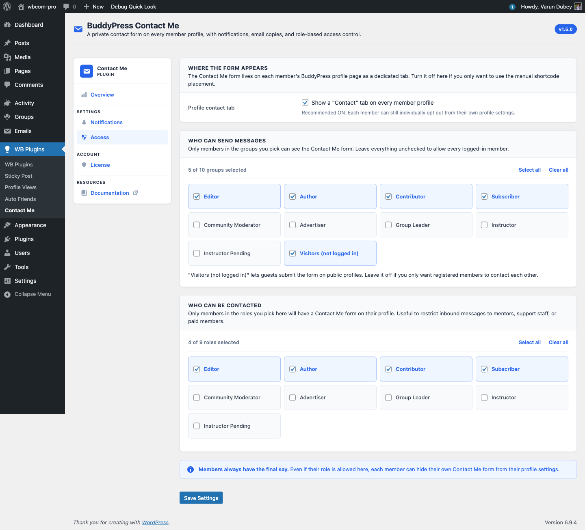

# Access Tab — Who Can Send & Be Contacted

The Access tab controls every gate around the contact form: where it appears, which roles can send a message, and which roles can receive one.

## Where the form appears

A single toggle at the top:

- **Show a "Contact" tab on every member profile** — when off, the profile-tab integration is hidden entirely. Members can still be contacted via the `[buddypress-contact-me]` shortcode if you want to drive contact through specific landing pages.

Recommended ON. Each member can still individually opt out from their own profile settings — see [Per-member opt-out](../features/opt-out.md).

## Who can send messages

A grid of role chips covering every WordPress role on the site, plus a special **Visitors (not logged in)** chip for guest contact.

- Tick the chips for the roles you want to allow.
- Use **Select all** / **Clear all** to apply to the visible group.
- An empty grid is persisted — you can intentionally lock all roles out (not common, but supported).

The Visitors chip controls whether the form appears for logged-out users. When unticked, guests see no form on member profiles and the REST endpoint rejects unauthenticated submissions with "You are not allowed to send messages."

## Who can be contacted

The same chip grid, applied to the **recipient** side. A member's Contact tab only renders if their role intersects this allow-list (or they are an administrator — admins are always contactable regardless).

Use this to restrict inbound messages to a specific group: mentor accounts, support staff, paid members. Members in unchecked roles do not show the Contact tab on their profiles even when the global toggle above is on.

## Members always have the final say

The blue notice at the bottom is a reminder: even when a role is allowed, the individual member can still opt out via **Profile → Settings → General → Let other members contact me**. The plugin never overrides the per-member preference — see [Per-member opt-out](../features/opt-out.md).

## Mobile-friendly chips

The grid uses chip controls instead of a multi-select dropdown. This is intentional:

- All options are visible at once — no hidden state hiding behind a click.
- Tap targets are large enough for thumb interaction on mobile.
- **Select all** / **Clear all** apply to the visible group, scoped per-grid.

## Save behaviour

Saving the Access tab only touches the role allow-lists and the **Show a Contact tab** toggle. Notification preferences set on the [Notifications](notifications-tab.md) tab are preserved — the two tabs save independently.

## What's next

Once access is configured, the [License](license-tab.md) tab links your purchase to your site so future updates flow into the WordPress Plugins screen.
