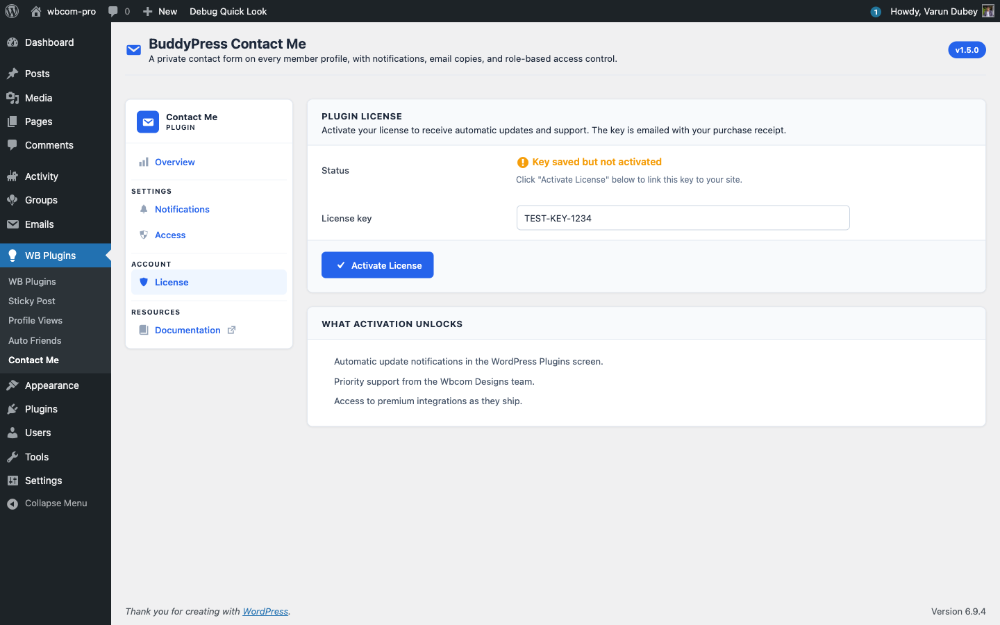

# License Tab — Activate & Rotate Keys

The License tab is where you connect your Wbcom Designs purchase to this site so the plugin can pull updates.

## Activate a key

1. Go to **WB Plugins → Contact Me → License**.
2. Paste your license key into the **License key** field.
3. Click **Activate License**.

On success, the **Status** flips to "Active: receiving updates" and the field becomes read-only.

You will find your key in the purchase confirmation email or under **My Account → Purchase History** at wbcomdesigns.com.

## Status states

- **No key entered** — initial state, the field is empty.
- **Key saved but not activated** — you saved a key locally but the activation server has not been contacted yet. Click **Activate License** again — usually a transient connectivity issue.
- **Active: receiving updates** — the key is bound to this site and the slot is consumed on your account.
- **Inactive** — the key was deactivated or the activation expired. Updates will not pull until you reactivate.

## Deactivate to move the key

When you want to use the same key on a different site:

1. Click **Deactivate License**.
2. The field unlocks and the slot frees up on your wbcomdesigns.com account.
3. Paste the key into the new site and activate there.

Deactivation submits inline — there is no confirmation popup (1.5.0 changed this to match the standard EDD pattern). If you accidentally deactivate, just click **Activate License** to bind it back.

## What activation unlocks

- Update notifications appear in **Plugins → Installed Plugins** when new releases ship.
- One-click updates pull straight from `https://wbcomdesigns.com`.
- Priority support from the Wbcom Designs team.

The plugin keeps every feature working without an active license. Only updates and support are gated. If you prefer manual updates, you can drop in a new ZIP and skip the License tab entirely.

## Inline error messages

Activation errors render inline on the License tab — you do not get bounced to a different screen. Common messages:

- **"Invalid license."** Mistyped or refunded key.
- **"Your license is not active for this URL."** Key is in use elsewhere and the site count is exhausted. Deactivate it on the other site first or upgrade to a higher site count.
- **"Your license key has expired."** The license renewal lapsed. Renew at wbcomdesigns.com to continue receiving updates.

## Multisite networks

License activation is per-site. On a multisite network, each subsite needs its own activation against your license. If you license a high-tier multi-site key, count each subsite as one slot.

## What's next

That covers admin configuration. The [Features](../features/profile-contact-form.md) section walks through the user-facing surfaces in detail.
