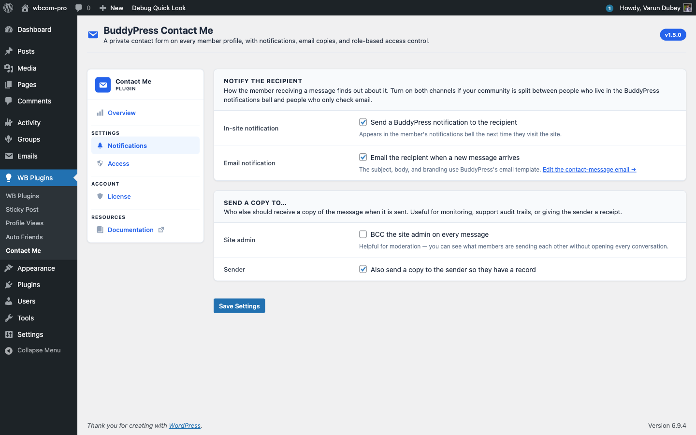

# Notifications Tab — Recipient & Copy Settings

The Notifications tab decides what happens **after** a message is submitted: who gets notified, by which channel, and whether copies fan out to admins or the sender.

## Notify the recipient

Two channels for the person receiving the message — both can be on at the same time:

- **In-site notification** — sends a BuddyPress notification bell entry. Appears the next time the recipient visits the site, links straight to the single-message view at `/contact/inbox/{id}/`. Requires the BuddyPress Notifications component to be active.
- **Email notification** — sends an email through the BuddyPress email template (subject, body, header, footer, unsubscribe). Edit the template content at **Dashboard → Emails** under "A member received a contact message".

If both are off, the message is still saved to the database — it just sits in the recipient's inbox until they happen to visit the Contact tab. Most communities should leave at least one channel on.

## Send a copy to…

Two extra recipient toggles:

- **Site admin** — BCC every message to every user with the `administrator` role. Useful for community moderation: admins keep their inbox visible without logging in as each member.
- **Sender** — send the sender a copy of what they submitted. Acts as a "we got your message" receipt, reduces "did my message go through?" support tickets, and gives the sender a paper trail.

The sender-copy applies to both members (delivered to their account email) and guests (delivered to the email address they typed into the form).

## Edit the email template

Above the **Email notification** toggle there is an inline link: **Edit the contact-message email →**. Clicking it opens **Dashboard → Emails** filtered to the email post type term `bcm-contact-message`, so you can tweak subject and body without hunting through every BP email.

The five tokens you can use in the template are:

- `{{sender.name}}` — display name of the sender (or guest name).
- `{{recipient.name}}` — recipient's display name.
- `{{contact.subject}}` — the message subject.
- `{{{contact.message}}}` — the message body (auto-paragraphed; triple braces because it contains HTML).
- `{{{inbox.url}}}` — deep link to the message in the recipient's inbox.

Plus every BP-native token like `{{{site.name}}}` and the unsubscribe link.

## Independent saves

The Notifications tab and the Access tab are independent. Saving the Notifications tab only touches the notification-related options — your role allow-lists are untouched. This is enforced via per-tab "rendered keys" sentinels so an Access save can never accidentally reset notification preferences (or vice versa).

## What's next

Notifications cover *how* members find out. The [Access](access-tab.md) tab controls *who* can send and receive in the first place.
